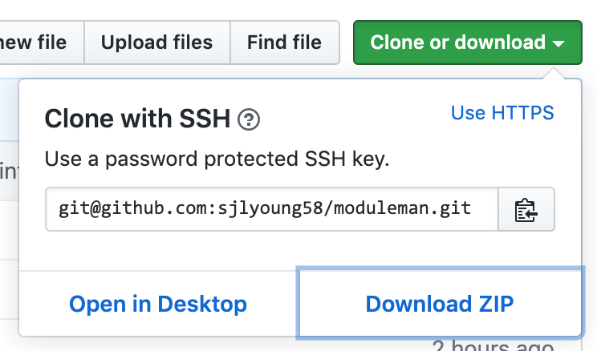

# moduleman
This node js project analyses your Elite Dangerous journals
and produces handy references for all of your ships and modules
## Current status
Currently only one output is created - a list of your ships with
links to coriolis.io website

The system is designed to run by default on the same Windows PC you use to
run Elite Dangerous. If you want to run it on a different machine, you probably know what you are doing, so it isn't covered here

# Getting started

If you haven't already got node js v10 or above on your PC you will need to install it

Check if you have node js and what version - start a Command prompt and type

`node -v`

If node is already installed at version 10 or higher you can skip the next section
## Installing node js

**IMPORTANT** - do *not* install nvm to a path containing spaces, it won't work

First, follow this Microsoft guide to
[install Node Version Manager](https://docs.microsoft.com/en-us/windows/nodejs/setup-on-windows) (nvm) on Windows

Once nvm is installed successfully, use nvm in a command prompt to install node js version 12.6.3 and set this as the preferred version to use

`nvm install 12.16.3`

`nvm use 12.16.3`

## Copy this project to your PC

If you are reading this guide, you are probably on the right page on github to
download a copy of this project

Extract the contents of the zip to a location of your choice on your PC

## Running the code
### First time only (or whenever a new version is downloaded)
Start a command prompt in the root of the extracted project and type the following -

`npm install`

This will pull down all of the node js packages required by this project

Next run this from the root of the project (i.e. do not `cd scripts` first) -

`.\scripts\preparedb.bat`

This should initialise a Sqlite database in the `./db/` folder

### Every time you wish to analyse your journals for new content
By default, the code will look for journals in the standard default location for Elite. If this is not where you have your journals, edit .\src\config\config.mjs to set the correct location for your journals

Start a command prompt in the root of the extracted project (i.e. do not `cd scripts` first) and type the following -

`.\scripts\run.bat`

This will create a web page of all your ships. Use File... Open... to open
`.\public\links.html` in your browser

You can refresh your output file every time your journals change by rerunning `.\scripts\run.bat`
